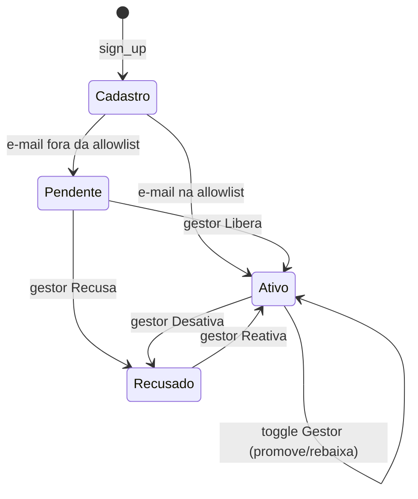

# Regras — Criação de Espaços, Listas e Tarefas

Documento de referência sobre como funciona a criação da estrutura do
workspace. Serve para revisão e para entender o fluxo sem ler o código todo.

---

## Hierarquia

Tudo se encaixa em três níveis. É essa ordem que explica as regras:

```
Espaço (tabela spaces)          ex: "Desenvolvimento", prefixo DEV
  └─ Lista (tabela lists)        ex: "Sprint atual"
       └─ Tarefa (tabela tasks)  ex: DEV-101 "Corrigir webhook"
```

- Uma **tarefa** sempre mora dentro de uma **lista**.
- Uma **lista** sempre mora dentro de um **espaço**.
- Consequência prática: sem espaço não dá para criar lista; sem lista não dá
  para criar tarefa.

---

## 1. Criação de ESPAÇOS

**Quem pode:** só gestor. O botão "＋ Novo espaço" só aparece para gestor, e o
RLS (`sql/02_rls.sql`, política `spaces_write`) é a segunda tranca no banco.

**Campos:** nome, **prefixo** (único, só letras) e cor.

**Por que o prefixo é obrigatório e único:** ele vira o código das tarefas
daquele espaço (ex.: `DEV-101`). Ver a seção de tarefas.

**Fluxo:**

1. Clique em "＋ Novo espaço" na sidebar → `abrir_criar_espaco()` marca
   `criando_espaco = True` na sessão e dá rerun.
   - `src/ui/espacos.py` → `abrir_criar_espaco()`
2. `render_modais` vê a chave e abre o modal `_dialog_criar_espaco`.
   - `src/ui/espacos.py` → `_dialog_criar_espaco()`
3. Ao salvar, a tela valida antes de ir ao banco: nome vazio, prefixo vazio,
   prefixo com números e prefixo duplicado são barrados na hora.
4. `catalog.criar_espaco(nome, prefixo, cor)` faz o `INSERT` em `spaces`, com
   `ordem` = "último + 1" (entra no fim da árvore).
   - `src/repo/catalog.py` → `criar_espaco()`
5. Limpa o cache, mostra o toast e dá rerun → o espaço aparece na árvore.

**Corrida entre dois gestores:** se dois criarem o mesmo prefixo ao mesmo
tempo, o `unique` do Postgres decide, e o `APIError` é tratado na tela com a
mensagem de prefixo em uso.

---

## 2. Criação de LISTAS

**Quem pode:** só gestor. Botão "＋ Nova lista" só para gestor + RLS
(`lists_write`). O botão fica desabilitado enquanto não existir nenhum espaço.

**Campos:** nome, espaço de destino (dropdown) e ícone.

**Fluxo:**

1. Clique em "＋ Nova lista" → `abrir_criar_lista()` marca `criando_lista = True`
   e dá rerun.
   - `src/ui/espacos.py` → `abrir_criar_lista()`
2. `render_modais` abre o modal `_dialog_criar_lista`.
   - `src/ui/espacos.py` → `_dialog_criar_lista()`
3. Ao salvar, `catalog.criar_lista(space_id, nome, icone)` faz `INSERT` em
   `lists`. A `ordem` é "última daquele espaço + 1" → a lista entra no fim do
   espaço escolhido.
   - `src/repo/catalog.py` → `criar_lista()`
4. Limpa o cache, toast "Lista criada" e rerun → aparece na árvore, embaixo do
   espaço.

A lista é um agrupador simples: só nome + ícone dentro de um espaço. Não tem
estado próprio além disso.

**Ícones disponíveis** (rótulo → nome guardado no banco):
`Lista → list`, `Bug → bug`, `Camadas → layers`, `Design → figma`.
A sidebar desenha `figma` como o ícone `palette`.

---

## 3. Criação de TAREFAS

**Quem pode:** qualquer membro ativo (não é privilégio de gestor).

**Campos** (vêm de `_campos_comuns`, compartilhados entre criar e editar):

- Título e Lista (em qual lista a tarefa entra)
- Status / Prioridade
- Responsável / Data limite
- Tags e Descrição

**Fluxo:**

1. Clique em "＋ Criar Tarefa" (botão roxo no topo da sidebar) →
   `abrir_criacao()` marca `criando_tarefa = True`.
   - `src/ui/task_detail.py` → `abrir_criacao()`
2. `render_modais` abre o modal `dialog_criar`.
   - `src/ui/task_detail.py` → `dialog_criar()`
3. Ao salvar, `tasks.criar(list_id=..., titulo=..., tags=..., **campos)` faz o
   `INSERT` em `tasks`.
   - `src/repo/tasks.py` → `criar()`

**O código da tarefa (ex.: DEV-101) é gerado pelo banco, não digitado:**

Um *trigger* no Postgres (`sql/01_schema.sql`) roda no momento do insert:
olha a lista → descobre o espaço → pega o `prefixo` do espaço (ex.: `DEV`) e o
`proximo_numero`, monta `DEV-101` e incrementa o contador. **É por isso que o
espaço exige um prefixo único.**

**Tags moram em outra tabela** (`task_tags`), então são gravadas num segundo
passo, separado do insert principal da tarefa.
- `src/repo/tasks.py` → `criar()` → `_gravar_tags()`

---

## 4. Edição de TAREFAS

**Quem pode:** qualquer membro ativo. A edição acontece no mesmo modal de
detalhe que abre ao clicar num card.

**Campos:** título + os mesmos campos de `_campos_comuns` (status, prioridade,
responsável, data limite, tags, descrição). O código da tarefa aparece no topo,
mas é só leitura — não muda.

**Fluxo:**

1. Clique num card → `abrir(task_id)` marca `tarefa_aberta = <id>` na sessão.
   - `src/ui/task_detail.py` → `abrir()`
2. `render_modais` busca a tarefa no banco (`tasks.obter`) e abre o modal
   `dialog_detalhe`. Se a tarefa sumiu entre o clique e o rerun (alguém
   excluiu), o modal fecha sozinho.
   - `src/ui/task_detail.py` → `render_modais()`, `dialog_detalhe()`
3. Você altera os campos e clica em "Salvar alterações".
4. Valida o título (não pode ficar vazio) e chama
   `tasks.atualizar(task_id, {titulo, **campos}, visto_em=atualizado_em)`.
   - `src/repo/tasks.py` → `atualizar()`
5. Se as tags mudaram, um segundo passo grava só a diferença via
   `tasks.definir_tags`.
6. Toast "Tarefa salva", fecha o modal e dá rerun.

**Trava de edição concorrente (o ponto mais importante):**

Quando o modal abre, ele guarda o `atualizado_em` que a tarefa tinha naquele
momento (`visto_em`). No `UPDATE`, esse valor entra no `WHERE` junto com o id.

- Se ninguém mexeu no meio tempo, o `atualizado_em` ainda bate → o update casa
  a linha e salva.
- Se outra pessoa salvou antes de você, o `atualizado_em` no banco já mudou →
  o update **não casa nenhuma linha** → `tasks.atualizar` levanta
  `ConflitoDeEdicao`, e a tela mostra o aviso "Outra pessoa salvou esta tarefa
  enquanto você editava. Feche e abra de novo para ver a versão atual."

Isso evita que quem salva por último apague, calado, o trabalho de quem salvou
primeiro. É controle de concorrência otimista.

> **Exceção — mudar status pelo card:** arrastar/trocar a coluna de um card usa
> `tasks.mudar_status`, que **não** tem essa trava de propósito. Mudar de coluna
> é ação de um clique; barrar com "alguém editou antes" seria pior que deixar
> passar. `src/repo/tasks.py` → `mudar_status()`.

**A data da entrega é carimbada pelo banco, não pela tela:** ao mover a tarefa
para "Concluído" — pelo modal ou pelo card — o trigger `tasks_set_concluido_em`
grava `concluido_em` com o momento da transição, e o apaga se a tarefa for
reaberta. Nenhum código Python envia esse campo, então as duas rotas de escrita
ficam corretas de graça.

Não confunda com `atualizado_em`, que muda a **cada** edição e serve só para a
trava de concorrência acima. Usar `atualizado_em` como data de entrega foi
justamente o bug que fazia o painel acusar atraso em tarefa entregue no prazo —
ver *Regras de Cálculo de Prazos e Datas* no `README.md` e `src/prazos.py`.

---

## 5. Exclusão de TAREFAS

**Quem pode:** só quem **criou** a tarefa ou um **gestor**. A regra é do banco
(RLS, política `tasks_delete`), não só da tela.

**Confirmação em dois passos:** o botão nunca apaga direto. Um clique errado
dentro de um modal apertado não pode apagar a tarefa de ninguém.

**Fluxo:**

1. No fim do modal de detalhe, clique em "Excluir tarefa" → isso só **arma** a
   confirmação (`confirmar_exclusao = <id>` na sessão) e dá rerun. Nada é
   apagado ainda.
2. Aparece o aviso "Excluir **<tarefa>**? Isso não tem volta." com dois botões:
   - **"Sim, excluir"** → chama `tasks.excluir(task_id)`.
   - **"Cancelar"** → limpa a chave `confirmar_exclusao` e volta ao normal.
   - `src/ui/task_detail.py` → `dialog_detalhe()` (bloco de exclusão no fim)
3. `tasks.excluir` faz o `DELETE` e devolve `bool`:
   - `True` → fecha o modal, toast "Tarefa excluída" 🗑️ e rerun.
   - `False` → o RLS recusou (você não criou a tarefa nem é gestor); a tela
     mostra o erro explicando isso.
   - `src/repo/tasks.py` → `excluir()`

**Efeito cascata:** ao apagar a tarefa, o banco apaga junto — por `on delete
cascade` — as **tags**, **subtarefas** e **comentários** ligados a ela. Não
sobra órfão.

> **Nota — excluir subtarefas e comentários** (itens de dentro da tarefa, não a
> tarefa toda): cada um tem seu próprio botão de lixeira dentro do modal, com
> exclusão direta (sem os dois passos). Comentário só pode ser apagado por quem
> escreveu ou por um gestor. `src/ui/task_detail.py` → `_secao_subtarefas()`,
> `_secao_comentarios()`.

---

## 6. Espaços — navegação, escopo e exclusão

Além de serem criados (seção 1), os espaços são o **eixo de navegação** da
sidebar. Clicar na árvore não abre nada — troca o **escopo** do quadro, ou seja,
o conjunto de tarefas que a tela mostra.

**Os três escopos possíveis** (`(tipo, id)` guardado na sessão):

- `("tudo", None)` — botão "Todas as tarefas": sem filtro, mostra tudo.
- `("espaco", id)` — clicou num espaço: mostra as tarefas de **todas as listas**
  daquele espaço.
- `("lista", id)` — clicou numa lista: mostra só as tarefas **daquela lista**.

**Como o escopo vira filtro:**

1. Clicar numa linha da árvore chama `definir_escopo(tipo, id)`, que grava o
   escopo na sessão e dá rerun.
   - `src/ui/sidebar.py` → `definir_escopo()`
2. Ao desenhar o quadro, `listas_do_escopo()` traduz o escopo num conjunto de
   `list_id` (ou `None`, que significa "sem filtro").
   - `src/ui/sidebar.py` → `listas_do_escopo()`
3. Esse conjunto entra em `tasks.listar(list_ids=...)`, que só traz as tarefas
   das listas do escopo. Os filtros do topo (busca, prioridade, responsável)
   somam a isso.
   - `app.py` → `_tela_tarefas()`

**A barra de migalhas** (breadcrumbs) no topo reflete o escopo: `contexto()`
devolve o par (espaço, lista) do escopo atual para a tela desenhar o caminho.
- `src/ui/sidebar.py` → `contexto()`

**Os campos do espaço** (tabela `spaces`) e para que servem:

| Campo | Papel |
|---|---|
| `nome` | Rótulo na árvore |
| `cor` | Ponto colorido ao lado do nome |
| `prefixo` | Prefixo do código das tarefas (ex.: `DEV`). Único. |
| `proximo_numero` | Contador do código; começa em 101 e sobe a cada tarefa |
| `ordem` | Posição na árvore |

**O contador de código:** cada espaço tem seu próprio `proximo_numero`. Quando
uma tarefa é criada numa lista daquele espaço, o trigger do banco usa o
`prefixo` + `proximo_numero` para montar o código (`DEV-101`) e incrementa o
contador. Por isso o número não é global — é por espaço.

### 6.1 Exclusão de um espaço

Excluir espaço é a **operação mais destrutiva do app**: por causa da cadeia de
`on delete cascade` (`sql/01_schema.sql`), apagar um espaço apaga junto **todas
as suas listas**, **todas as tarefas dessas listas** e as **tags, subtarefas e
comentários** delas — pode ser centenas de registros num só delete, sem volta.
Por isso a confirmação é mais forte que a de tarefa.

**Quem pode:** só **gestor**. O gatilho só aparece para gestor, e o RLS
(`spaces_write`, que é `for all` e portanto cobre o DELETE) é a segunda tranca
no banco. Nenhuma mudança de RLS foi necessária — a permissão de DELETE já
existia.

**Onde fica o botão:** é **contextual**. Selecione um espaço na árvore da
sidebar e o botão "🗑 Excluir «Nome»" aparece embaixo de "Nova lista". Fica
fora da linha da árvore de propósito: o CSS dela posiciona o ponto colorido por
cima do botão, então mexer no layout arriscaria quebrar o visual.
- `src/ui/sidebar.py` → `_acoes_gestor()`

**A trava — digitar o nome (padrão cascata + confirmação por texto):**

1. Clique em "🗑 Excluir «Nome»" → `abrir_excluir_espaco(space_id)` marca
   `excluindo_espaco = <id>` na sessão e dá rerun.
   - `src/ui/espacos.py` → `abrir_excluir_espaco()`
2. `render_modais` abre o modal `_dialog_excluir_espaco`.
   - `src/ui/espacos.py` → `_dialog_excluir_espaco()`
3. O modal mostra o **raio de destruição antes de tudo**: quantas listas e
   quantas tarefas somem junto (conta com `catalog.listas()` filtrado pelo
   espaço + `tasks.contagem_por_espaco()`).
4. O botão "Excluir definitivamente" fica **desabilitado** até você digitar o
   **nome exato** do espaço. Um clique por reflexo não basta para uma exclusão
   desse tamanho.
5. `catalog.excluir_espaco(space_id)` faz o `DELETE` em `spaces` e devolve `bool`:
   - `True` → fecha o modal, toast "Espaço excluído" 🗑️ e rerun.
   - `False` → o RLS recusou (você não é gestor); a tela mostra o erro.
   - `src/repo/catalog.py` → `excluir_espaco()`

**Reset de escopo:** se o quadro estava filtrado pelo espaço apagado (ou por uma
lista dele), o filtro apontaria para algo que não existe mais e mostraria um
quadro vazio sem explicação. Então, ao excluir, o escopo volta para "Todas as
tarefas".

**Concorrência:** se outro gestor apagou o mesmo espaço entre o seu clique e o
rerun, `_dialog_excluir_espaco` não encontra o espaço e fecha sozinho, em vez de
quebrar.

> **Comparação com a exclusão de tarefa (seção 5):** tarefa usa confirmação em
> dois passos (armar → "Sim, excluir"), porque o estrago é pequeno e localizado.
> Espaço exige **digitar o nome**, porque o estrago é em massa. Mesma filosofia
> de "a segurança real está no banco (RLS), a UI só evita acidentes", com a trava
> proporcional ao tamanho do que pode ser perdido.

---

## 7. Times (tela de Equipe)

**Quem pode:** só gestor. A opção "Equipe" na navegação só aparece para gestor,
e a própria tela recusa quem não é (`render` verifica `eu.gestor`). Todas as
escritas passam pelo RLS de `profiles`/`allowed_emails` como segunda tranca.
- `src/ui/team.py` → `render()`

Esta tela existe para **liberar acessos sem abrir o SQL Editor** do Supabase. É
composta por quatro seções.

### 7.1 Aguardando liberação (pendentes)

Quem se cadastrou e ainda não foi aprovado. Um perfil novo nasce com
`ativo = False` e espera aqui.

- **Liberar** → `catalog.liberar(id)` (marca `ativo = True`, `recusado = False`).
- **Recusar** → `catalog.recusar(id)` (marca `ativo = False`, `recusado = True`).
- `src/ui/team.py` → `_secao_pendentes()`

### 7.2 Equipe ativa

Todos os membros liberados. Cada linha traz:

- **Toggle "Gestor"** → `catalog.definir_gestor(id, bool)` promove/rebaixa.
- **Desativar** → `catalog.recusar(id)` tira o acesso (vai para "desativados").
- `src/ui/team.py` → `_secao_equipe()`

**Trava do último gestor:** você **não** consegue se rebaixar nem se desativar
se for o **único** gestor. Sem isso, o workspace ficaria sem ninguém capaz de
liberar acessos — e só o SQL Editor sairia dessa, que é justo o que a tela quer
evitar. Promova outra pessoa a gestor antes de sair.

### 7.3 Pré-autorizar e-mail (convites / allowlist)

Opcional. Um e-mail nesta lista (`allowed_emails`) **já entra liberado** ao se
cadastrar, sem passar pela fila de aprovação.

- **Adicionar** → `catalog.convidar(email, nome, gestor)`. O flag "Gestor" já
  cria a pessoa como gestor quando ela se cadastrar.
- **Remover** → `catalog.remover_convite(email)`.
- `src/ui/team.py` → `_secao_convites()`

### 7.4 Recusados e desativados

Expander no fim com quem foi recusado ou desativado.

- **Reativar** → `catalog.liberar(id)` traz a pessoa de volta para a equipe ativa.
- `src/ui/team.py` → `_secao_recusados()`

**Padrão comum a tudo aqui:** as funções de escrita devolvem `bool`; `False`
significa que o RLS recusou (seu perfil deixou de ser gestor), e a tela mostra
o aviso pedindo para recarregar. `src/ui/team.py` → `_falhou()`.

---

## 8. Autenticação e login

A autenticação usa o **Supabase Auth** (e-mail + senha). O app não guarda senha:
o Supabase cuida disso, e o app só troca tokens. Toda a lógica está em
`src/auth.py`, e a persistência entre F5 em `src/session.py`.

### 8.1 Registro (criar conta)

1. Na aba "Criar conta", a pessoa informa nome, e-mail e senha (mín. 6
   caracteres, com repetição para conferir).
2. `sign_up` cria o usuário no Supabase, passando o nome em `options.data`.
   - `src/auth.py` → `_form_registro()`
3. Um **trigger no banco** (`tk_handle_new_user`) cria automaticamente a linha
   em `profiles` a partir desse usuário. O perfil nasce **inativo**
   (`ativo = False`) — a não ser que o e-mail esteja na allowlist (seção 7.3),
   caso em que já entra liberado.
4. Se o "Confirm email" estiver ligado no Supabase, `sign_up` volta **sem
   sessão**: a tela pede para confirmar o e-mail pelo link antes de entrar.

### 8.2 Login (entrar)

1. Na aba "Entrar", informa e-mail e senha.
2. `sign_in_with_password` autentica; erros comuns são traduzidos para
   português (credenciais inválidas, e-mail não confirmado, senha curta, sem
   conexão).
   - `src/auth.py` → `_form_login()`, `_mensagem_erro()`
3. Deu certo → `_guardar_sessao` grava `user_id` e `perfil` na sessão e agenda
   o cookie do refresh token.

### 8.3 O portão de entrada (`exigir_login`)

Chamado no início do `app.py`, barra a passagem até existir um **perfil ativo**.
Os desfechos possíveis:

- **Sem sessão em memória** (ex.: F5) → tenta restaurar pelo cookie
  (`restaurar_sessao`). Se não der, mostra a tela de acesso e `st.stop()`.
- **Autenticado mas sem perfil** → erro pedindo para conferir se os scripts de
  `sql/` foram aplicados (o trigger não rodou).
- **Perfil inativo** (`ativo = False`) → tela "Acesso pendente", esperando um
  gestor liberar (seção 7.1).
- **Perfil ativo** → devolve o `Perfil` e o app segue.
- `src/auth.py` → `exigir_login()`

### 8.4 Sessão entre recarregamentos (cookie + refresh token)

O `st.session_state` vive na memória do servidor, atado à conexão websocket. Um
F5 abre conexão nova e perderia a sessão. A solução:

1. Ao logar, o **refresh token** do Supabase é guardado num cookie
   (`tk_refresh`).
2. No F5, `restaurar_sessao` lê o cookie e chama `refresh_session`, trocando-o
   por uma sessão nova. O Supabase **rotaciona** o refresh token a cada uso,
   então o novo é regravado — senão o F5 seguinte cairia no login.
   - `src/auth.py` → `restaurar_sessao()`
3. O cookie é de **sessão do navegador** (sem `max-age`): sobrevive ao F5 e ao
   restart do servidor, mas some quando a pessoa fecha o navegador. Ninguém fica
   logado no dia seguinte.
   - `src/session.py` (módulo inteiro; ver o docstring para os detalhes)

**Detalhe do Streamlit:** ele **lê** cookies, mas não **escreve**. A gravação é
feita por um componente HTML de altura zero que roda `document.cookie` no
navegador. Por isso escrita e leitura ficam defasadas de um carregamento — e é
por isso que `session.sincronizar()` é chamado em todo run, **antes** de
qualquer `st.stop()` (senão o logout agendaria a remoção do cookie e nunca a
executaria).

### 8.5 Logout

`logout()` faz `sign_out` no Supabase, limpa `sb_client`/`perfil`/`user_id` da
sessão, agenda a remoção do cookie e dá rerun.
- `src/auth.py` → `logout()`

### 8.6 Níveis de acesso (campos do perfil)

| Campo | Significado |
|---|---|
| `ativo` | `True` = pode usar o app. `False` = pendente ou desativado. |
| `gestor` | `True` = vê a tela de Equipe e cria/edita espaços e listas. |
| `recusado` | `True` = cadastro recusado ou conta desativada. |

O modelo e a leitura da linha estão em `src/models.py` (`Perfil.de_linha`).

### 8.7 Ciclo de vida do acesso

Junta o registro (seção 8) com a gestão de time (seção 7). Cada estado é uma
combinação dos flags `ativo` e `recusado` do perfil:



**Os estados e os flags por trás deles:**

| Estado | `ativo` | `recusado` | Como chega | Função |
|---|---|---|---|---|
| **Cadastro** | — | — | `sign_up` cria o perfil (trigger) | `_form_registro` |
| **Pendente** | `False` | `False` | cadastro sem allowlist | trigger `tk_handle_new_user` |
| **Ativo** | `True` | `False` | liberado (ou allowlist) | `catalog.liberar` |
| **Recusado / Desativado** | `False` | `True` | recusado ou desativado | `catalog.recusar` |

**Notas:**

- **Allowlist é atalho:** um e-mail pré-autorizado (seção 7.3) pula "Pendente" e
  já nasce "Ativo".
- **Reativar** usa a mesma função de liberar (`catalog.liberar`) — "desativado"
  e "recusado" são o mesmo estado no banco, só mudam de painel na tela.
- **Ser gestor não é um estado à parte:** é um flag (`gestor`) sobre um perfil
  ativo. Promover/rebaixar (`catalog.definir_gestor`) não tira ninguém do estado
  "Ativo" — daí o laço no diagrama.
- **Só um gestor decide as transições** de "Pendente"/"Recusado"; o cadastro é a
  única transição que a própria pessoa dispara.

---

## Observações de implementação

- **Um `st.dialog` por vez:** o Streamlit só permite um modal aberto por run.
  O `app.py` renderiza o modal de espaço/lista primeiro; se ele abriu, o de
  tarefa fica de fora naquele run (`if not espacos.render_modais(eu): ...`).
- **Estado dos modais:** nenhum modal guarda estado próprio. Quem manda é uma
  chave em `st.session_state`; qualquer rerun reabre o modal no mesmo lugar, e
  fechar é só limpar a chave.
- **RLS como segunda tranca:** mesmo escondendo os botões, o banco recusa
  escrita de não-gestor devolvendo zero linhas. Por isso as funções de criação
  retornam `bool`: `False` = "o banco recusou".
- **Cache:** as leituras de espaços/listas ficam em cache por 30s
  (`catalog.TTL`). Toda criação chama `invalidar_cache()` para a árvore
  refletir a mudança na hora.

---

## Arquivos envolvidos

| Arquivo | Papel |
|---|---|
| `src/ui/espacos.py` | Modais de criar espaço/lista e excluir espaço |
| `src/ui/task_detail.py` | Modais de criar/editar/excluir tarefa |
| `src/ui/sidebar.py` | Árvore de navegação, escopo do quadro e botões de criação |
| `src/ui/team.py` | Tela de Equipe: liberar, promover, convidar, desativar |
| `src/auth.py` | Registro, login, logout e o portão `exigir_login` |
| `src/session.py` | Persistência da sessão (cookie do refresh token) |
| `src/models.py` | `Perfil` e a leitura da linha do banco |
| `src/repo/catalog.py` | `criar_espaco`, `criar_lista`, `excluir_espaco` e gestão de perfis/convites |
| `src/repo/tasks.py` | `criar` (escrita de tarefa no banco) |
| `src/prazos.py` | Cálculo de prazo, atraso e tempo de ciclo (módulo puro) |
| `sql/01_schema.sql` | Tabelas + triggers de código, `atualizado_em` e `concluido_em` |
| `sql/06_concluido_em.sql` | Migração da data de entrega em bancos já existentes |
| `sql/02_rls.sql` | Políticas RLS (quem pode escrever) |
| `app.py` | Orquestra qual modal desenhar por run |
